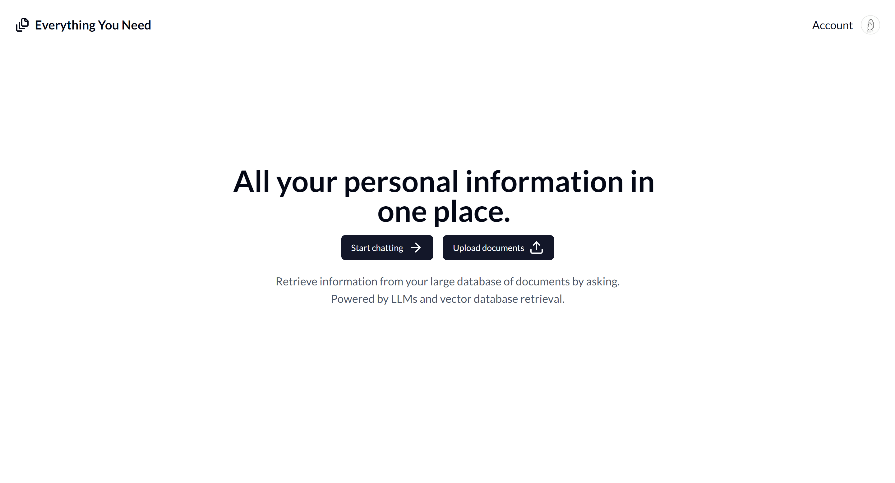
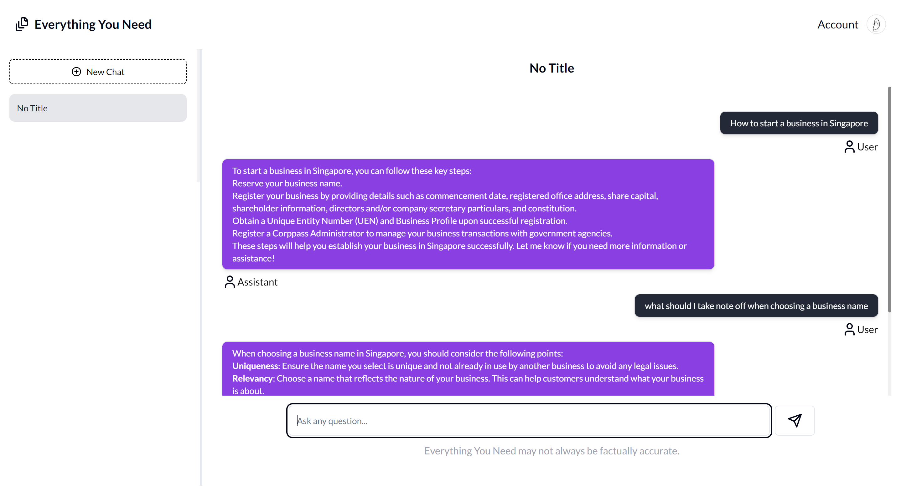

# **Everything you need**
==========================

**Imagine having all the information you need at your fingertips...**

Everything you need is a revolutionary AI-powered tool that helps you quickly find accurate answers from your documents. With our advanced Retrieval Augmented Generation (RAG) technology, you can:

• Get precise answers to your questions based on the content of your documents
• Save time searching through multiple documents
• Focus on making informed decisions instead of digging through information

**How it works**

Provide your documents and questions, and our tool will use RAG to extract relevant information and provide a comprehensive answer.

**Try it out**
------------

Visit our site at https://everything-you-need.vercel.app/ to try out the tool for yourself!

**Features**
----------

* **Contextual Answering**: Get precise answers to your questions based on the content of the documents you provide.
* **Multi-Document Support**: Supply multiple documents, and the tool will extract relevant information from each to provide a comprehensive answer.
* **Advanced Retrieval**: Leverage the power of RAG to retrieve information from various document types, including PDFs and more.
* **Accurate Contextualization**: The tool understands the context of your questions and provides answers that take into account the nuances of the documents you've provided.

**Screenshots**
----------

Screenshot of the tool's home page

Screenshot of the chat page

Screenshot of the page to upload documents

**Author**
----------

* Lim Zhen Yang

**Tech Stack**
---------------
+ NextJS
+ Dizzle
+ TailwindCSS
+ PostgreSQL
+ OpenAI ChatGPT
+ Pinecone
+ Langchain
